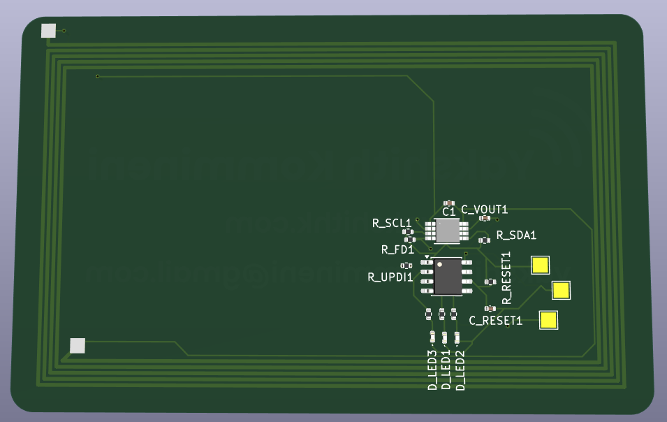
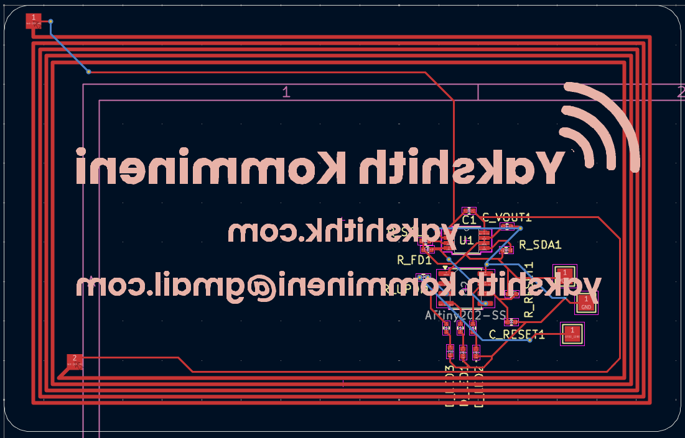
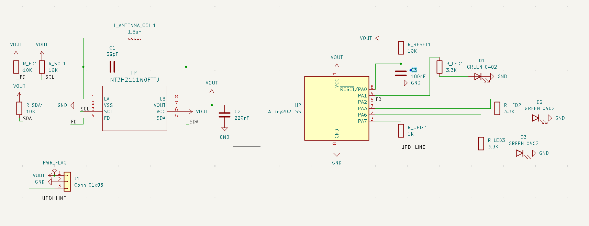

# Glassboard

A transparent NFC business card that lights up when you tap your phone to it. No battery. No charging. Ever.




---

## What is it

Glassboard is a credit card sized transparent circuit board. It stores my contact info and portfolio link using NFC. When someone taps their phone to it, two things happen at once: their phone opens my portfolio link, and three green LEDs on the card light up and animate.

The entire card runs off the energy from the phone's own NFC signal. There is no battery inside. Nothing to charge. The card just sits in your wallet and works whenever someone taps it.

Because it's built on a transparent substrate, you can see through the card. Every trace, every component, and the antenna spiral are all visible. It looks like a piece of glass with circuits inside.

---

## Why I made it

I kept handing people plain paper business cards at hackathons. It felt wrong. I build hardware, but the card said nothing about that.

I wanted a card that proved what I do the moment someone touched it. So I built one.

---

## How it works

The card has two chips on it.

The first is the **NT3H2111**, an NFC chip from NXP. It stores my URL in its memory and harvests power from the phone's NFC field. When a phone gets close, the chip outputs around 3V on its power pin, which powers everything else on the card.

The second is the **ATtiny202**, a tiny microcontroller. It spends almost all of its time asleep, drawing basically no power. When the NFC chip detects a phone, it sends a signal to the ATtiny, which wakes up instantly, runs the LED animation for about 2 seconds, then goes back to sleep.

The antenna is a copper spiral coil built directly into the circuit board. It has 5 turns and is tuned to 13.56 MHz, which is the frequency all NFC phones use.

The three LEDs are green because green LEDs turn on at a lower voltage than blue or white ones, which matters a lot when you're running off harvested power.

---

## How to use it

**Tapping it:**
Hold the card against the back of any NFC enabled phone (most smartphones made after 2015 have NFC). The phone will show a notification to open a link. Tap it. The LEDs on the card will also light up at the same time.

If nothing happens, try moving the card around slowly. The NFC antenna in phones is usually near the top or center of the back.

**Changing the URL:**
1. Download the NXP TagWriter app (free on both iOS and Android)
2. Open the app and select "Write"
3. Choose "Link" and type in the URL you want
4. Hold your phone to the card
5. Done. The old URL is replaced with the new one

No programmer needed for this. The NFC chip handles it wirelessly.

**Reprogramming the LED animation:**
1. Get a CH340 USB to UART adapter (about $3 on Amazon)
2. Connect it to the three small pads on the bottom edge of the card: VCC, GND, and UPDI
3. Install megaTinyCore in Arduino IDE (add this URL to board manager: `http://drazzy.com/package_drazzy.com_index.json`)
4. Select board: ATtiny202, clock: 5MHz internal, programmer: UPDI
5. Open `firmware/glassboard.ino` and upload

---

## PCB




| Spec | Value |
|------|-------|
| Substrate | Transparent FPC (PET) |
| Layers | 2 |
| Thickness | 0.2mm |
| Dimensions | 85.6 x 54mm (credit card size) |
| Surface finish | ENIG (gold) |
| Made by | JLCPCB |

---

## Parts list

Full BOM with purchase links is in `BOM.csv`.

| Part | Description | Quantity |
|------|-------------|----------|
| NT3H2111W0FTT | NFC chip, TSSOP8 | 1 |
| ATtiny202-SSF | Microcontroller, SOIC8 | 1 |
| Wurth 150040GS73240 | Green LED, 0402 | 3 |
| 220nF cap | Decoupling, 0402 | 1 |
| 100nF cap | RESET filter, 0402 | 1 |
| 39pF cap | Antenna tuning, 0402 | 1 |
| 10pF cap | Optional tuning, 0402 (DNP) | 1 |
| 10k resistor | Pull-ups, 0402 | 4 |
| 3.3k resistor | LED current limit, 0402 | 3 |
| 1k resistor | UPDI protection, 0402 | 1 |
| Transparent FPC PCB | From JLCPCB | 1 |

Total cost is around $32 for 5 boards including shipping.

---

## Firmware

The firmware file is at `firmware/glassboard.ino`.

It puts the ATtiny202 into deep sleep mode. When the NT3H2111 detects a phone, its FD pin goes LOW, which triggers a hardware interrupt on the ATtiny. The MCU wakes up, runs a chase animation across the three LEDs, then goes back to sleep. The whole active cycle takes about 2 seconds.

---

## Files

```
glassboard/
├── README.md
├── BOM.csv
├── firmware/
│   └── glassboard.ino
├── hardware/
│   ├── glassboard.kicad_pro
│   ├── glassboard.kicad_sch
│   ├── glassboard.kicad_pcb
│   └── gerbers/
├── Glassboard_Zine.pdf
└── images/
    ├── 3d_front.png
    ├── 3d_back.png
    ├── pcb.png
    ├── schematic.png
    └── zine.png
```

---

## Zine page


---

Made by Yakshith Kommineni, age 17, Brampton Ontario Canada
